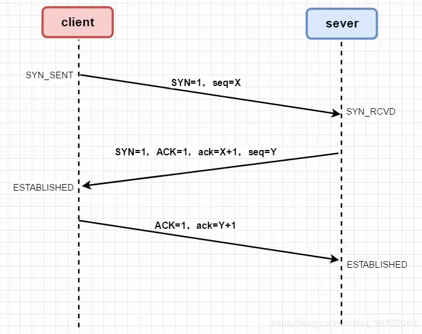

# 浏览器从输入URL到页面渲染

### 1. DNS解析

> 在浏览器输入URL后，首先要经过域名解析。浏览器通过向 DNS 服务器发送域名，DNS 服务器查询到与域名相对应的 IP 地址，然后返回给浏览器，浏览器再将 IP 地址打在协议上，同时请求参数也会在协议搭载，然后一并发送给对应的服务器。

### 2. TCP连接：TCP三次握手

> 在客户端发送数据之前会发起 TCP 三次握手用以同步客户端和服务端的序列号和确认号，并交换 TCP 窗口大小信息。

### 3. 浏览器向web服务器发送HTTP请求

> HTTP请求报文格式：请求行+请求头+空行+消息体，请求行包括请求方式（GET/POST/DELETE/PUT）、请求资源路径（URL）、HTTP版本号

### 4. 服务器处理请求并返回HTTP报文

> 服务器收到请求后会发出应答，即响应数据。HTTP响应与HTTP请求相似， HTTP响应报文格式：状态行+响应头+空行+消息体，状态行包括HTTP版本号、状态码、状态说明。

### 5. 浏览器解析渲染页面

> 浏览器拿到响应文本后，解析HTML代码，请求js，css等资源，最后进行页面渲染，呈现给用户。页面渲染一般分为以下几个步骤：
> * （1）根据HTML文件解析出DOM Tree
> * （2）根据CSS解析出 CSSOM Tree(CSS规则树)
> * （3）将 DOM Tree 和 CSSOM Tree合并，构建Render tree(渲染树)
> * （4）reflow(重排)：根据Render tree进行节点信息计算（Layout）
> * （5）repaint(重绘)：根据计算好的信息绘制整个页面（Painting）

### 6. TCP四次挥手

> 当数据传输完毕，需要断开TCP连接，此时发起tcp四次挥手

